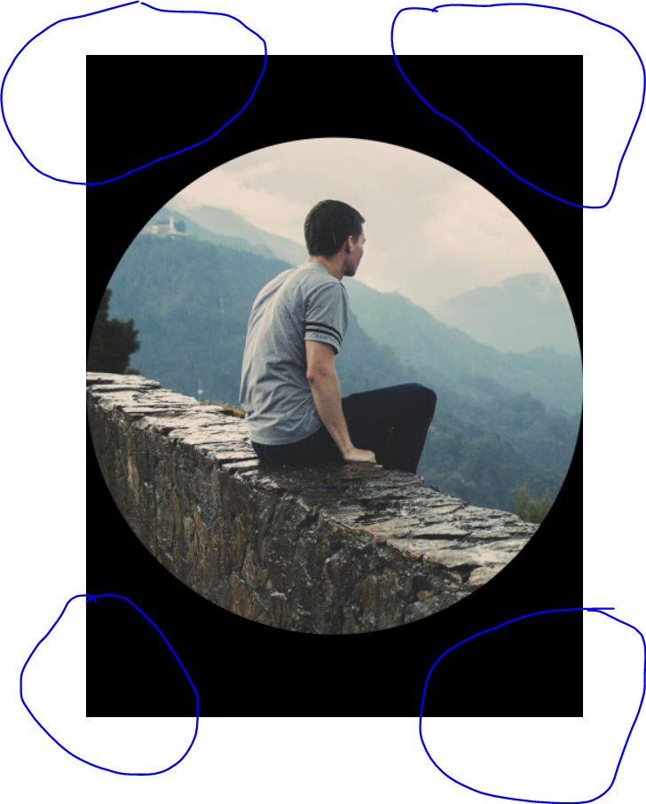

# ImageCrop Mendix Widget 

This [Widget](https://appstore.home.mendix.com) | [Demo](https://imagecropdemo100-sandbox.mxapps.io/index.html?profile=Responsive) is a wrapper for the [Croppie](https://foliotek.github.io/Croppie/) image cropping library and you can use it to crop images in your Mendix App.

## How does it work?

After you put the widget in a data-view with an entity which inherits from `'System.Image'` and once you run your application and the widget is initialized, it will create an instance of the same type as the context, this instance will be the object that will be coupled with the resulted/cropped image. 

After cropping an image successfully, a **mandatory** Microflow will be triggered & applied on the resulted object, you can use this Microflow to apply your logic on the resulted image. An **Optional** Microflow also will be triggered and applied on the original image (context) e.g. delete the original image after cropping.

## Usage & Configuration
1. Place the widget in a data-view with an entity inherits from (has the generalization of) `'System.Image'`.
2. Set Cropped Image Microflow, this is where you will get the control on the resulted image.
3. Set Original Image Microflow, this is where you will get the control on the original image [optional].
4. Set your cropping configuration.
5. Set your configuration for the resulting image.

## Available Options

### Handlers :

| Name      | Type        | Description|
|:---------:|-------------|------------|
| Cropped Image MF| Microflow |   This microflow returns the control on the cropped image. Cropped image Object will be passed as a parameeter to the Microflow.|
|Original Image MF| Microflow|This microflow returns the control on the original image. Orignal image Object will be passed as a parameeter to the Microflow.|

### Options :
| Name      | Type        | Description|
|:---------:|-------------|------------|
|Boundary Width| Number(integer)|The width of the widgte in `px`.|
|Boundary Height|Number(integer) |The height of the widgte in `px`.|
|Viewport Type| Enum: ('Circle','Square')|The type of the viewport (cropping window).|
|Enable Zoomer| Boolean |Enable/Disable zooming on the image.|
|Enable Resize| Boolean |Enable/Disable resizing the image.|
|Mouse Wheel Zoom| Enum: ('Yes' , 'Yes + Ctrl' , 'No') |Enable/Disable the ability to zoom on the image by the mouse wheel. if `Yes + Ctrl` is selected, this means that you need to press `Ctrl` in order for the zooming with mouse wheel to work. Please note that zommer should be enabled.|
|Crop Button Style|  Enum: ('Default' , 'Primary' , 'Success' , 'Info' , 'Warning' , 'Danger') |Sets the style of the cropping button.|
|Show Preview| Boolean |Display/Hide the preview image of your current selection.|

### Result Image Options :
| Name      | Type        | Description|
|:---------:|-------------|------------|
|Format|Enum('png' , 'jpg')|The format of the resulted image.|
|Quality| Number(float)|A decimal number between 0 and 1 defines the compression rate on the resulted image. Please note that this option is only applicable when the selected format is `Format: jpg`.|
|Size| Enum('Viewport', 'Original')| If `Viewport` is selected, the size of the resulting image will be the same width and height as the viewport. If `Original` is selected, the size of the resulting image will be at the original scale of the image.|

## Minimum Mendix Version: 

Mx6.0.1 or higher.

## Limitations & Known Issues:
1. Initializing the widget in an invisible element will cause the widget to function inconsistently in regard to viewing & cropping the image you want to crop. e.g. using the widget in a 'Gropu box' container with the default state is set to 'start collapsed'. We'll consider fixing this issue in a future release. However, if this situation occurs it has no sideeffects on any other component.
2. When you set the `Viewport` to be `Circle` and the `Fomrat` to `jpg`, the areas of the resulted image that are outside the cropped circle will be replaced with black background. Please  see the image below : 

